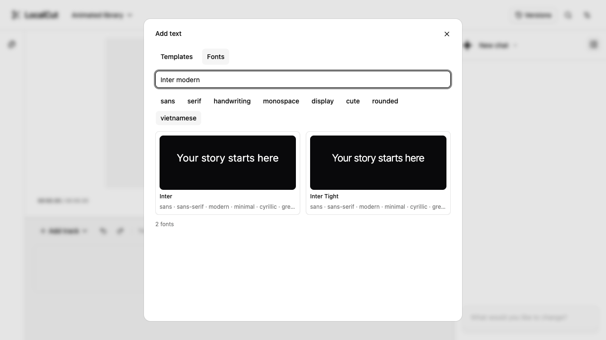

# LocalCut

A browser video editor with local media processing and an optional AI editing assistant. Import your own media, edit a timeline, and export a video without creating an account or running a backend.

[Try LocalCut](https://wilsonle.github.io/LocalCut/) · [Get started](docs/getting-started.md) · [Contribute](CONTRIBUTING.md) · [Documentation](docs/README.md) · [Changelog](CHANGELOG.md) · [Get help](SUPPORT.md)



## What you can do

- Import video, audio and images; record a screen, window or browser tab through the browser's source picker.
- Arrange tracks, trim and group clips, separate audio, adjust speed and pitch, and edit transitions.
- Add styled and animated text, use bundled fonts, and generate captions with explicitly prepared local Whisper transcription.
- Review AI editing proposals before applying them. Optional OpenRouter, compatible endpoints and ChatGPT connections support configured service routes; speech generation uses an explicit Generate action.
- Export MP4/H.264/AAC or WebM/VP9/Opus when your browser supports the required codecs.
- Save projects and versions in this browser and export portable project/workspace backups with optional original media.

The application builds to static files. The separately built `editor.js` and `ai.js` entries expose the shared editing engine and assistant for other consumers; see the [API](docs/api.md). This repository is an application, not a published npm package (`private: true`).

## Browser support and data

Current stable desktop **Google Chrome** is the complete acceptance target. Native Safari has a separate macOS regression suite; that coverage does not establish full Chrome parity. Mobile layouts are available, but storage, capture and codec support depend on the browser/device. Export formats are capability-checked at runtime.

Projects and originals live in IndexedDB/OPFS on this browser and origin. There is no cloud sync. Browser data clearing, eviction, changing browser profiles, or moving to a different host can make projects unavailable. Export backups with originals before relying on long-term retention. No service worker is installed, so full offline navigation is not supported; local inference can reuse explicitly downloaded model/runtime caches while the application is available.

Local editing and default Whisper transcription process media on the device. Optional AI actions can send prompts and permitted metadata, indexing excerpts, authored speech scripts, or approved transcription audio to configured providers. Saved browser credentials are readable by scripts on the same origin. Read [privacy and data flows](docs/privacy.md) before connecting a provider.

## Your first edit

1. Open the app, create a project or open one saved in this browser, and import your media.
2. Select clips and edit the timeline or Clip properties. Preview, Undo and Redo use the same editing engine as export.
3. Optionally connect a provider in Chat, describe an edit and review the proposed operations. Choose Apply or Discard.
4. Open **Settings → Export**, choose an available format, export, then Save video.
5. Use **Settings → Project → Export project** or **Settings → Workspace → Export workspace** for a backup; select original assets if the backup must stand alone.

See the [first-edit guide](docs/getting-started.md) for versions, provider setup and backup recovery.

## Setup

Install Node 24 LTS, then the pinned pnpm 11.25.0. Check `node --version` reports `v24.x` before installing dependencies:

```sh
npm install --global pnpm@11.25.0
git clone https://github.com/WilsonLe/LocalCut.git
cd LocalCut
pnpm install --frozen-lockfile
pnpm dev
```

Current desktop Google Chrome is required for native codec, OPFS, Web Locks, and production integration tests. Local editing requires no runtime environment variables, accounts, servers, or secrets. Optional remote AI needs an explicitly connected provider key or ChatGPT OAuth sign-in. Custom endpoints must allow browser CORS. HTTPS or localhost is required for browser storage.

Contributors: start with [CONTRIBUTING.md](CONTRIBUTING.md). Coding agents must also read [AGENTS.md](AGENTS.md). Use the [development guide](docs/development.md) for module ownership, fast check selection, build reuse, and the single review-and-address cycle.

Validation runs locally with `pnpm check` and the applicable real transcription/performance acceptance commands. Hosted CI is disabled. GitHub Pages builds and publishes automatically on every push to `main`; release packaging remains separate from local validation. Confirmed manual redeployment is also available. See [deployment and rollback](DEPLOY.md).

| Command                               | Purpose                                                       |
| ------------------------------------- | ------------------------------------------------------------- |
| `pnpm dev`                            | Local editor workspace at the root path                       |
| `pnpm typecheck`                      | Strict browser, worker, Node/test/config checks               |
| `pnpm lint`                           | ESLint and pure-core import boundaries                        |
| `pnpm format:check`                   | Prettier                                                      |
| `pnpm test`                           | Domain and service unit tests                                 |
| `pnpm build`                          | App + `editor.js` + `ai.js` + worker assets + declarations    |
| `pnpm build:root`                     | Equivalent build at `/` in `dist-root`                        |
| `pnpm test:browser`                   | Production integration in Google Chrome                       |
| `pnpm test:safari`                    | Native Safari storage and H.264/AAC regressions (macOS)       |
| `pnpm test:profile <label> <command>` | Wall time, descendant CPU/RSS and host utilization profile    |
| `pnpm test:tooling`                   | Resource scheduling and verified-build cache regressions      |
| `pnpm test:ui`                        | Focused workspace tests; rebuild only stale production assets |
| `pnpm test:transcription`             | Real pinned Whisper preparation and cached replay             |
| `pnpm test:performance`               | Warmup, two- and five-minute 1080p exports                    |
| `pnpm test:ai:live`                   | Opt-in real OpenRouter test; private key and model required   |
| `pnpm check:bundle`                   | Actual entry graph and static artifact budgets                |
| `pnpm check`                          | Normal formatting/lint/type/unit/build/bundle/browser gates   |

Browser commands require both production builds first, except `test:ui` and `test:safari`, which verify or build them automatically. The harness server is test-only and never enters `dist`. Unit concurrency adapts to CPU availability, current load, available memory (including reclaimable OS cache), and cgroup limits. Normal Chrome runs concurrent isolated contexts in one shared stable-Chrome process. `LOCALCUT_BROWSER_WORKERS` bounds the parallel context workers within the live capacity budget. `LOCALCUT_TEST_SLOTS=1` makes the check pipeline serial; `LOCALCUT_UNIT_WORKERS=1` narrows the unit pool; `LOCALCUT_BROWSER_WORKERS=1` keeps browser runs serial. Overrides accept positive safe integers and only narrow available capacity; there are no fixed machine-size ceilings. Each shared-browser worker reserves one slot (0.75 GiB); independently launched browser workers retain two slots. Functional UI checks prefer reduced motion; dedicated animation and keyboard-focus checks retain full motion. Transcription, performance, and live-provider tests remain serial, explicit additional gates; none is included in ordinary `check`.

For UI iteration, run `pnpm test:ui`, or narrow it with `pnpm test:ui --grep 'speed rounding'`. It runs workspace tests at both static base paths. Content hashes verify build inputs and every output file before reuse; changed source, build configuration, dependencies, or missing/tampered output triggers a rebuild. Documentation and test-only edits do not. The stamps live in ignored `.cache/build-state/`, outside deployed assets. `pnpm check` uses the same verified-build reuse and retains all static, unit, artifact and Chrome gates. It refreshes its shared resource budget at gate boundaries and every second while waiting, overlaps independent checks, runs both builds in sequence, and starts browser consumers only after outputs pass the bundle gate.

TypeScript 7.0.2 supplies `tsc` through the `@typescript/native` alias. The `typescript` alias supplies Microsoft's pinned v6 compatibility API for typescript-eslint; it does not replace the production compiler. Dependencies and the lockfile are exact.

See [architecture](docs/architecture.md), [API](docs/api.md), [OpenRouter integration and privacy](docs/ai.md), [storage](docs/storage.md), [local transcription](docs/transcription.md), [verification](docs/validation.md), and [deployment](DEPLOY.md).

Native Safari: enable **Allow remote automation** in Safari’s Develop → Developer Settings once, then run `pnpm test:safari`. The suite uses installed Safari through `safaridriver`, verifies/reuses both builds, and runs serially with its own loopback ports. It checks storage reload and three MP4 round trips at each base path, including stereo WAV input, reimported AAC and silence. Unavailable native capabilities fail. Results and failure screenshots are saved in `test-results/safari/`. Playwright WebKit is not native Safari evidence. Safari is an explicit additional gate, with Chrome remaining the complete acceptance target.

## Versioning

LocalCut is currently **v0.1.0-alpha.1**, an unreleased alpha in initial development. Named releases follow [SemVer](https://semver.org/spec/v2.0.0.html) using the [project release policy](docs/releasing.md#semantic-versioning). Read the [short changelog](CHANGELOG.md) for user-facing outcomes and links to each version's full Git diff. Development deployments are identified by commit; no release tag has been published yet.

## Contributing and community

Bug reports, documentation fixes, accessibility improvements, reproducible browser checks and focused feature proposals are welcome. Start with [CONTRIBUTING.md](CONTRIBUTING.md), use the [issue templates](https://github.com/WilsonLe/LocalCut/issues/new/choose), and follow the [Code of Conduct](CODE_OF_CONDUCT.md). For questions use [SUPPORT.md](SUPPORT.md); for suspected vulnerabilities use [SECURITY.md](SECURITY.md).

The [roadmap](docs/roadmap.md) explains current priorities and how to propose work. [Governance](docs/governance.md) describes maintainer decisions, and the [maintainer guide](docs/maintaining.md) covers triage, reviews and releases. There is no promised support response time or release schedule.

## License

LocalCut's original code and documentation are available under the [MIT License](LICENSE). Dependencies, fonts, model assets and test fixtures retain their own licenses and attribution; see [THIRD_PARTY_NOTICES.md](THIRD_PARTY_NOTICES.md). Keep those notices and the per-family font licenses when distributing builds.
